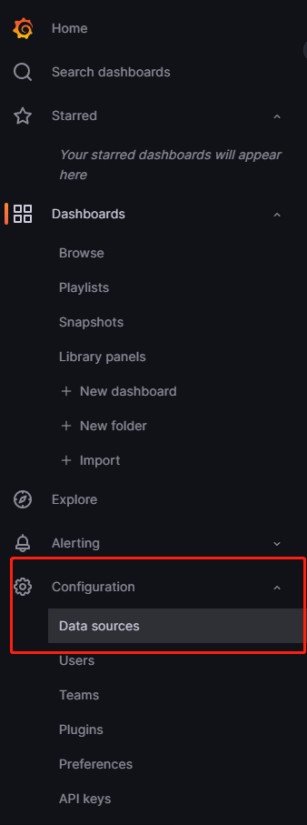
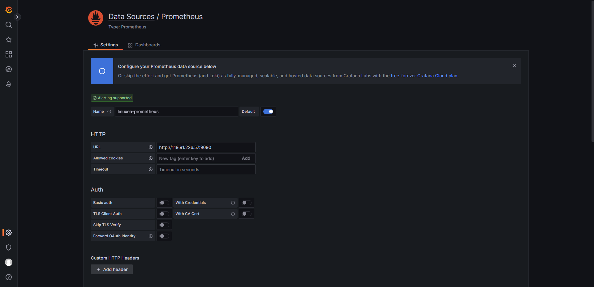
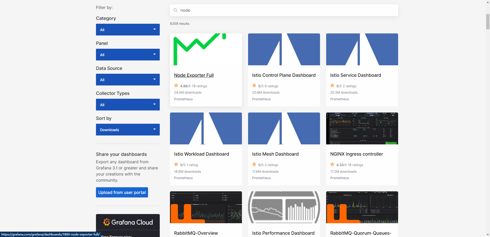
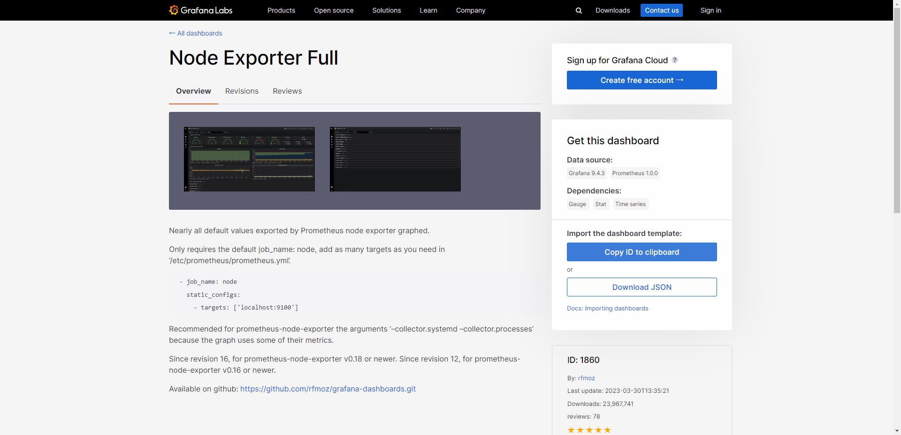
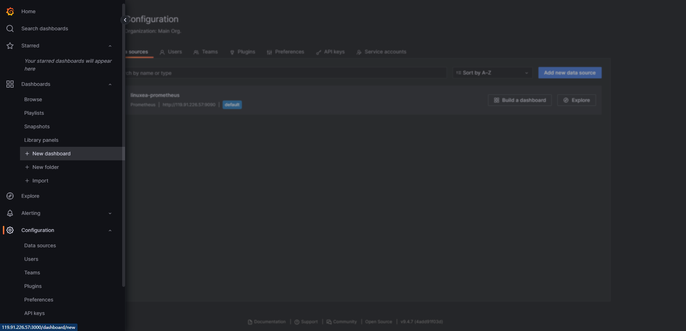
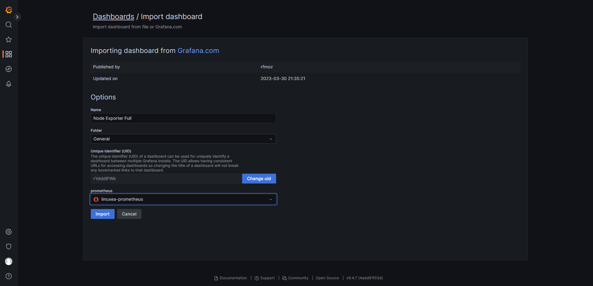
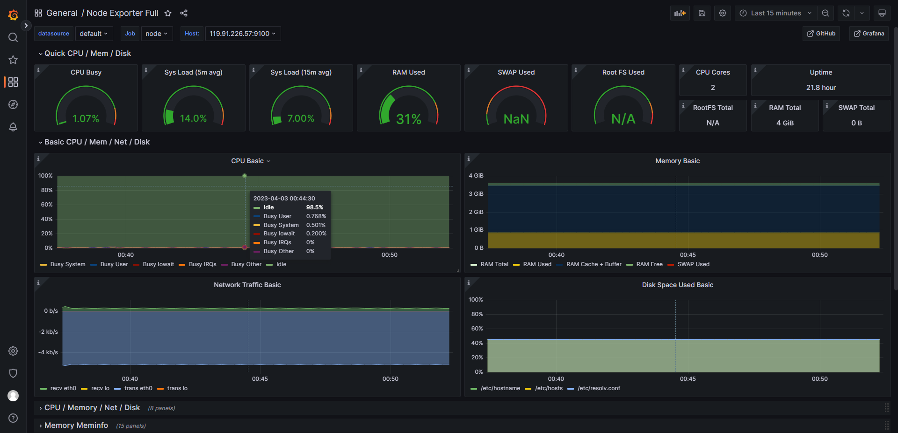
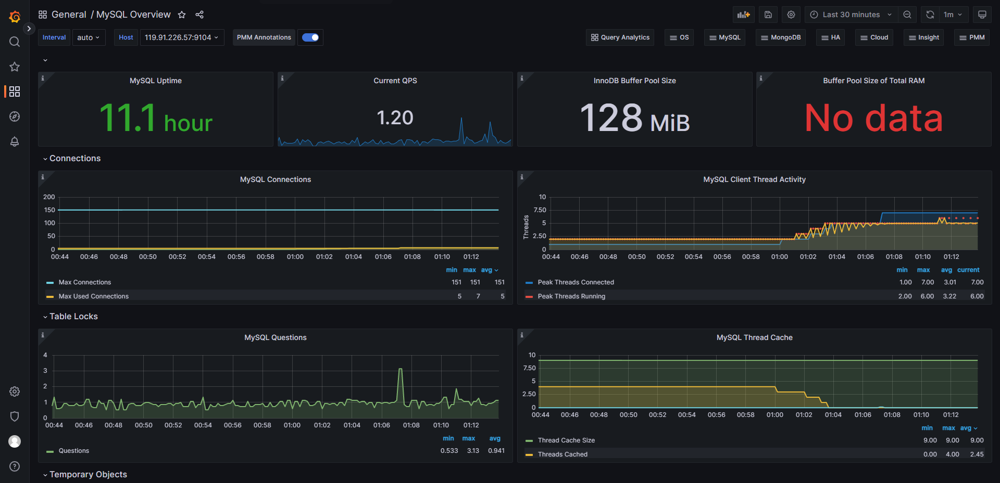
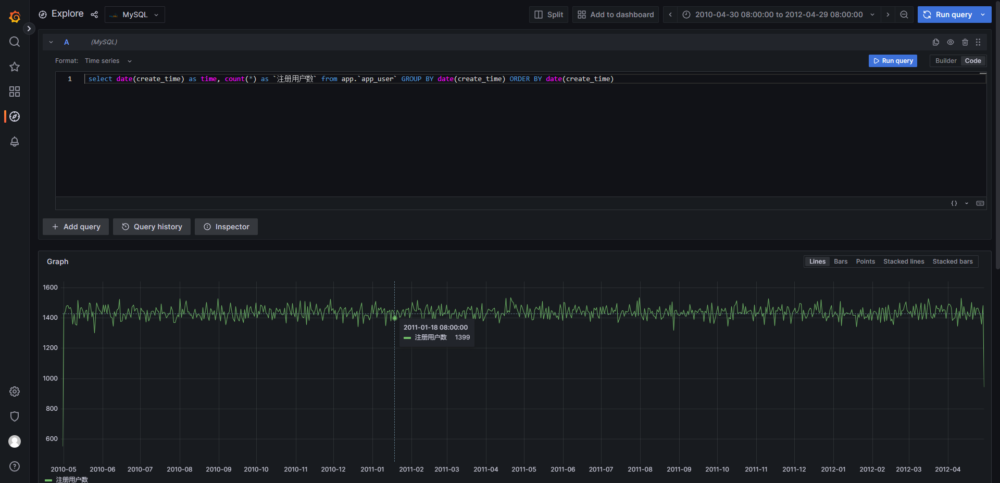

## Background

随着互联网服务和基础设施的日益复杂，监控成为了确保系统可用性、性能和安全性的重要手段。

监控可以帮助我们发现潜在的问题、优化资源利用率，提高用户体验。

本文将介绍如何使用 `Docker` 快速搭建 `Grafana` 和 `Prometheus` 监控平台，并通过 `mysql-exporter` 和 `node-exporter` 收集 `MySQL` 数据库和`服务器节点`的相关指标。


## Introduction

### Prometheus
Prometheus 是一款开源的、可靠的监控和告警系统，由 `SoundCloud` 开发并于 2012 年开始投入使用。Prometheus 使用 `pull` 模式收集指标数据，提供强大的数据模型和查询语言（`PromQL`），并且具有高度的可扩展性和集成能力。Prometheus 已成为云原生计算基金会（CNCF）的一员，并广泛应用于 Kubernetes 等云原生技术的监控中。

### Exporter

在 Prometheus 生态系统中，exporter 是一类专门用于收集和暴露目标系统的指标数据的软件。它们通常以 `HTTP` 服务的形式运行，提供一个用于 Prometheus 抓取数据的 `/metrics` 端点。以下是一些常见的 exporter 介绍：

- `node-exporter`：node-exporter 是一个官方提供的 exporter，用于收集服务器节点的硬件和操作系统指标。它可以提供诸如 CPU、内存、磁盘空间、网络流量等基本系统指标。这些指标有助于监控服务器的整体健康状况和资源利用情况。

- `mysqld-exporter`：mysqld-exporter（又称为 mysql-exporter）是一个官方提供的 exporter，用于收集 MySQL 数据库的性能指标。它可以提供关于查询、吞吐量、连接数、复制延迟等方面的详细信息，帮助你监控和优化数据库性能。

- `postgres_exporter`：postgres_exporter 是一个用于收集 PostgreSQL 数据库性能指标的 exporter。与 mysqld-exporter 类似，它提供了有关查询、连接数、锁定、复制等方面的指标，有助于了解 PostgreSQL 数据库的运行状况。

- `redis_exporter`：redis_exporter 是一个用于收集 Redis 数据库性能指标的 exporter。它提供了关于内存使用、客户端连接、命中率、慢查询等方面的指标，有助于监控和优化 Redis 数据库的性能。

这些 exporter 只是 Prometheus 生态系统中众多 exporter 中的一部分。实际上，许多应用程序和服务都有对应的 exporter，用于收集和暴露相关指标。此外，如果需要，你还可以编写自定义 exporter 来满足特定需求。总之，exporter 是 Prometheus 监控体系的重要组成部分，为各种场景提供了丰富的指标数据。

本文将介绍 node-exporter 与 mysqld-exporter 的搭建与启动。

### Grafana

Grafana 是一款开源的数据可视化和监控平台，支持多种数据源（如 Prometheus、InfluxDB 等）和丰富的图表类型。Grafana 提供了简洁的界面、灵活的面板配置和强大的告警功能，使得用户能够快速构建美观且实用的监控仪表盘。


## Startup


### 第一步：创建 `prometheus.yml` 配置文件
```yml
# my global config
global:
  scrape_interval: 15s # Set the scrape interval to every 15 seconds. Default is every 1 minute.
  evaluation_interval: 15s # Evaluate rules every 15 seconds. The default is every 1 minute.
  # scrape_timeout is set to the global default (10s).

# A scrape configuration containing exactly one endpoint to scrape:
# Here it's Prometheus itself.
scrape_configs:
  # The job name is added as a label `job=<job_name>` to any timeseries scraped from this config.
  - job_name: "prometheus"

    # metrics_path defaults to '/metrics'
    # scheme defaults to 'http'.

    static_configs:
      - targets: ["localhost:9090"]

  - job_name: node
    static_configs:
      - targets: ['localhost:9100']

  - job_name: 'mysqld_exporter'
    static_configs:
      - targets: ['localhost:9104']
```

这是一个 prometheus.yml 配置文件，用于配置 Prometheus 服务的抓取设置和目标。文件中包含以下部分：

- global：全局配置，包括：
  - scrape_interval：设置抓取间隔为 15 秒（默认为 1 分钟）。
  -evaluation_interval：设置规则评估间隔为 15 秒（默认为 1 分钟）。

- scrape_configs：一个包含多个抓取任务配置的列表。
  - 第一个任务名为 "prometheus"，用于抓取 Prometheus 本身的指标。它使用默认的 /metrics 路径和 http 方案。目标为 localhost:9090。
  - 第二个任务名为 "node"，用于抓取 Node Exporter 的指标。目标为 localhost:9100。请注意，这里的 IP 地址应替换为您自己的服务器地址。

  - 第三个任务名为 "mysqld_exporter"，用于抓取 MySQL Exporter 的指标。目标为 localhost:9104。请注意，这里的 IP 地址应替换为您自己的服务器地址。

此配置文件定义了三个抓取任务，分别用于收集 Prometheus 本身、Node Exporter 和 MySQL Exporter 的指标。


### 第二步：创建 Docker Compose 配置文件

```yml
version: '3'

services:
  prometheus:
    image: prom/prometheus:latest
    container_name: linuxea-prometheus
    volumes:
      - ./prometheus.yml:/etc/prometheus/prometheus.yml
    command: --config.file=/etc/prometheus/prometheus.yml
    ports:
      - 9090:9090

  grafana:
    image: grafana/grafana:latest
    container_name: linuxea-grafana
    ports:
      - 3000:3000

  mysql-exporter:
    image: prom/mysqld-exporter:latest
    container_name: linuxea-mysql-exporter
    environment:
      DATA_SOURCE_NAME: "root:root@(localhost:3306)/"
    ports:
      - 9104:9104

  node-exporter:
    image: prom/node-exporter:latest
    container_name: linuxea-node-exporter
    ports:
      - 9100:9100

```

这是一个 `docker-compose.yml` 文件，用于配置和运行以下四个服务：

- `prometheus`：使用官方的 prom/prometheus:latest 镜像。将本地的 prometheus.yml 配置文件挂载到容器的 /etc/prometheus/prometheus.yml 路径。Prometheus 服务将监听 9090 端口。

- `grafana`：使用官方的 grafana/grafana:latest 镜像。Grafana 服务将监听 3000 端口。

- `mysql-exporter`：使用官方的 prom/mysqld-exporter:latest 镜像。设置 DATA_SOURCE_NAME 环境变量以连接到 MySQL 数据库（请确保使用您自己的数据库连接信息）。MySQL Exporter 服务将监听 9104 端口。

- `node-exporter`：使用官方的 prom/node-exporter:latest 镜像。Node Exporter 服务将监听 9100 端口。

通过使用 `docker-compose up -d` 命令，这个文件将帮助你启动一个完整的监控平台，包括 Prometheus、Grafana、MySQL Exporter 和 Node Exporter。这个配置可以让你监控服务器节点的基本指标（通过 Node Exporter）以及 MySQL 数据库的性能指标（通过 MySQL Exporter）。


## 第三步：启动容器

在包含 `docker-compose.yml` 文件的目录中，运行以下命令：
```bash
docker-compose up -d
```

这将拉取所需的 Docker 镜像并启动所有服务。

稍等片刻，Grafana 和 Prometheus 将准备好使用。
```bash
docker-compose up -d
[+] Running 5/5
 ⠿ Container linuxea-node-exporter          Started                                                                                                                                                                                            1.1s
 ⠿ Container 995a970ff74e_linuxea-exporter  Recreated                                                                                                                                                                                          0.1s
 ⠿ Container linuxea-grafana                Started                                                                                                                                                                                            1.1s
 ⠿ Container linuxea-mysql-exporter         Started                                                                                                                                                                                            1.1s
 ⠿ Container linuxea-prometheus             Started                                                                                                                                                                                            1.1s
```


## 第四步：配置 Grafana

使用浏览器访问 http://localhost:3000，使用默认的用户名（admin）和密码（admin）登录 Grafana。
登录后，首先更改初始密码。
然后，转到 Configuration（配置）> Data Sources（数据源），添加一个新的 Prometheus 数据源，URL 设置为 http://localhost:9090。







## 最后，创建仪表盘和面板

这里我们推荐使用官方已经创建好的仪表盘配置。

https://grafana.com/grafana/dashboards/ 是 Grafana 官方提供的预制仪表板（dashboard）库。这些仪表板涵盖了各种应用程序、服务和系统的监控场景。通过使用这些预制仪表板，您可以快速设置和配置 Grafana 来显示所需的指标信息。

在库中，您可以找到适用于各种数据源（如 Prometheus、InfluxDB、Elasticsearch 等）和针对各种应用场景（如服务器监控、数据库监控、Kubernetes 监控等）的仪表板。这些仪表板可以节省您的时间，避免从头开始创建监控视图。

要使用预制仪表板，请按照以下步骤操作：

访问 https://grafana.com/grafana/dashboards/ 并在搜索框中输入关键词，或者使用过滤器来查找您所需的仪表板。




单击您感兴趣的仪表板，查看详情页面。这里您可以看到仪表板的预览、描述以及安装和配置说明。
记下仪表板的 ID（位于详情页面右上角）。



转到您的 Grafana 实例，登录并导航到 Dashboards > Manage（仪表板 > 管理）。



单击右上角的 "Import"（导入）按钮。
在 "Import Dashboard"（导入仪表板）窗口中，输入您在步骤3中记录的仪表板 ID，并单击 "Load"（加载）。
然后，选择正确的数据源（例如，我们第四步配置的 Prometheus 数据源），然后单击 "Import"（导入）。



现在，您应该可以在 Grafana 中查看和使用新导入的仪表板。根据需要，您还可以自定义仪表板，以便更好地满足您的监控需求。




类似地，我们配置 mysql 相关的仪表盘。最终展示效果如图：




## Other DataSource

Grafana 是一款开源的数据可视化和监控平台，支持多种数据源，除了 `promethemus`, 还可以添加 `mysql` 等作为数据源。



在 `Grafana` 中使用 `MySQL` 数据源意味着您可以将 `Grafana` 连接到您的 `MySQL` 数据库，并使用 `Grafana` 的功能来查询、可视化和分析存储在数据库中的数据。这使得 `Grafana` 成为一个灵活且强大的工具，可以满足许多不同类型的数据分析和监控需求。

使用 `MySQL` 数据源在 `Grafana` 中有以下优点：

- 集中管理和监控数据：通过使用 `Grafana`，您可以在同一仪表板上显示来自 `MySQL` 数据库和其他数据源（如 Prometheus、InfluxDB 等）的数据，实现多种数据来源的集中管理和监控。

- 丰富的可视化选项：`Grafana` 提供了丰富的图表类型和可视化选项，如折线图、饼图、表格、热力图等，可以帮助您更直观地分析和展示 MySQL 数据库中的数据。

- 自定义查询：`Grafana` 允许您使用 SQL 语言编写自定义查询，以便您可以根据需求筛选、聚合和转换存储在 MySQL 数据库中的数据。

- 动态仪表板和模板变量：`Grafana` 支持使用模板变量创建动态仪表板，这使得您可以轻松地根据不同的条件、时间范围或实体切换数据视图。

- 告警和通知：`Grafana` 提供了一个告警和通知系统，允许您基于 `MySQL` 数据源的数据设置告警阈值和条件，当满足条件时，`Grafana` 将发送通知到您选择的目标（如电子邮件等）。


## Summary

本文详细介绍了如何使用 `Docker` 搭建 `Grafana` 与 `Prometheus` 监控平台，并通过 `mysql-exporter` 和 `node-exporter` 收集 `MySQL` 数据库和`服务器节点`的相关指标。通过这个过程，我们可以快速部署一个可靠、灵活且易于扩展的监控环境，为互联网服务提供实时的性能和可用性信息。`Docker` 和 `Docker Compose` 的使用简化了搭建过程，使得监控系统的维护和升级变得更加方便。
同时我们添加了其他数据源：mysql。并且演示了如果在 Grafana 中管理 mysql 数据源。

希望本文能为你的监控项目提供有益的指导和启示。


## Reference

- [grafana] https://grafana.com
- [prometheus] https://prometheus.io/
- [docker compose] https://docs.docker.com/compose/gettingstarted