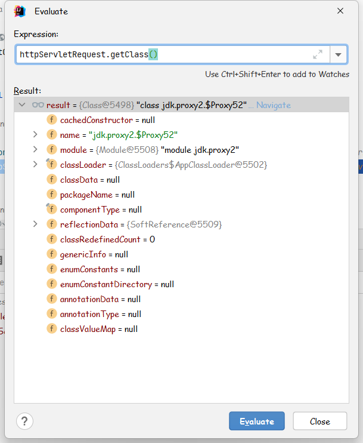
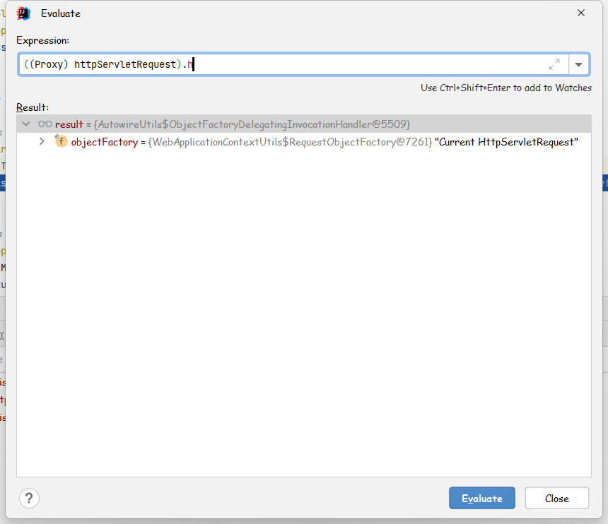

# HttpServletRequest In Spring Boot

## HttpServletRequest 字段注入形式

`HttpServletRequest` 拓展了 `ServletRequest` 接口，为 `Http Servlet` 提供了请求信息的封装。

在 `Http` 请求中，`servlet` 容器创建了 `HttpServletRequest` 对象并将它作为 `servlet` 的 `service` 方法中的参数。

今天在看项目代码中，把 `HttpServletRequest` 当做字段注入时，一开始感觉不可思议，感觉是不是写错了。它作为一个有状态的对象，在请求开始与结束又会涉及到对象的创建与销毁。

然而这是哪里出了问题呢。

于是先写了个测试验证一下。

```java
package com.linuxea.tutorial.controller;


import org.springframework.beans.factory.annotation.Autowired;
import org.springframework.web.bind.annotation.GetMapping;
import org.springframework.web.bind.annotation.RequestMapping;
import org.springframework.web.bind.annotation.RestController;

import javax.servlet.http.HttpServletRequest;
import java.util.Map;

@RestController
@RequestMapping("/test")
public class TestController {

    private final HttpServletRequest httpServletRequest;

    @Autowired
    public TestController(HttpServletRequest httpServletRequest) {
        this.httpServletRequest = httpServletRequest;
    }

    @GetMapping
    public Map<String, String[]> helloHttpServletRequest() {
        return httpServletRequest.getParameterMap();
    }

}

```

如上创建了一个用来测试的 `RestController`, 通过构造器注入 `HttpServletRequest` 对象。
通过 `Http` 请求调用 `TestController#helloHttpServletRequest` 方法并打印出请求的参数列表。

借助 `Idea` 自带的请求工具进行测试。
```
###
GET http://localhost:8080/test?name=linuxea&age=1

{
  "name": [
    "linuxea"
  ],
  "age": [
    "1"
  ]
}

###
GET http://localhost:8080/test?name=linuxea&age=12

{
  "name": [
    "linuxea"
  ],
  "age": [
    "12"
  ]
}

###
GET http://localhost:8080/test?name=linuxea&age=123

{
  "name": [
    "linuxea"
  ],
  "age": [
    "123"
  ]
}

```

每一次都能正确打印出正常的请求参数。证明了一开始注入的 HttpServletRequest 不是固定的。


## 代码调试

调试发现注入的 `HttpServletRequest` 是一个 `jdk` 代理对象：


查看这个代理对象所对应的 `InvocationHandler` 所处位置为`AutowireUtils$ObjectFactoryDelegatingInvocationHandler`



ObjectFactoryDelegatingInvocationHandler#invoke 方法的实现片断
```java
if (methodName.equals("equals")) {
  // Only consider equal when proxies are identical.
  return (proxy == args[0]);
}
else if (methodName.equals("hashCode")) {
  // Use hashCode of proxy.
  return System.identityHashCode(proxy);
}
else if (methodName.equals("toString")) {
  return this.objectFactory.toString();
}
try {
  return method.invoke(this.objectFactory.getObject(), args);
}
```

可以看到除了 `equals`, `hashCode`, `toString` 方法，其余方法都是通过交由 `this.objectFactory.getObject()` 来执行。

我们找到对应 `ServletRequest` 的关于 `ObjectFactory` 的实现：


RequestObjectFactory
```java
/**
  * Factory that exposes the current request object on demand.
  */
@SuppressWarnings("serial")
private static class RequestObjectFactory implements ObjectFactory<ServletRequest>, Serializable {

  @Override
  public ServletRequest getObject() {
    return currentRequestAttributes().getRequest();
  }

  @Override
  public String toString() {
    return "Current HttpServletRequest";
  }
}
```


前面讲到的方法委托给 `objectFactory.getObject()` 实现，而 `RequestObjectFactory` 的 `getObject()` 对应实现为 `currentRequestAttributes().getRequest();`

currentRequestAttributes()：
```java
/**
  * Return the current RequestAttributes instance as ServletRequestAttributes.
  * @see RequestContextHolder#currentRequestAttributes()
  */
private static ServletRequestAttributes currentRequestAttributes() {
  RequestAttributes requestAttr = RequestContextHolder.currentRequestAttributes();
  if (!(requestAttr instanceof ServletRequestAttributes)) {
    throw new IllegalStateException("Current request is not a servlet request");
  }
  return (ServletRequestAttributes) requestAttr;
}
```

一直跟踪下去，发现是通过 `ThreadLocal` 来实现与线程绑定的 `RequestAttributes`：
```java
private static final ThreadLocal<RequestAttributes> requestAttributesHolder = new NamedThreadLocal<>("Request attributes");
```

最终是通过 `currentRequestAttributes().getRequest();` 来获取当前请求的 `HttpServletRequest` 对象。


因此，代理 + 底层 `ThreadLocal` 存储的形式，通过字段注入 `HttpServletRequest` 对象是线程安全的。


> 当然使用上更好的方式可能是作为方法参数的注入让人不容易混淆从而产生疑问


## Summary

因为时间有限，没有更多了解背后设计上的原因。也许是基于使用者可能误使用 `HttpServletRequest` 等有状态对象的考虑或者其他原因。


