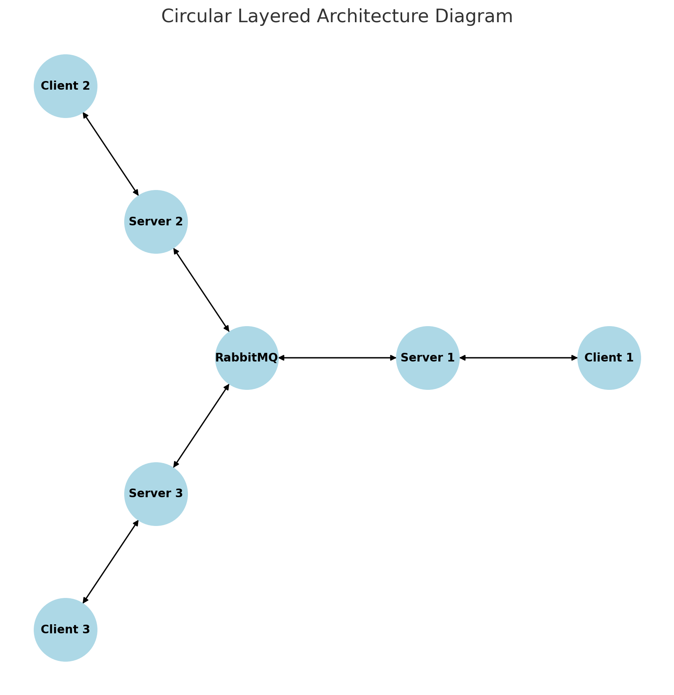

### 基于 Spring Boot、RabbitMQ、Redis 和 Socket.IO 的分布式聊天系统技术架构

在现代即时通讯（IM）应用中，随着用户规模的增长以及消息交互频率的增加，单一服务器架构已经难以满足需求，分布式架构逐渐成为高并发场景下的最佳选择。

本文将从技术架构的角度出发，详细介绍如何基于 **Spring Boot**、**RabbitMQ**、**Redis** 和 **Socket.IO** 搭建一个分布式的聊天系统，重点探讨分布式架构在 IM 场景下的扩展性及优势。

#### 系统技术架构概览

本系统的核心在于通过 Spring Boot 提供的开箱即用的集成能力，将多个服务组件紧密结合，实现一个高效、实时的分布式聊天系统。具体来说：

1. **Spring Boot**：作为应用框架，Spring Boot 提供了对 RabbitMQ、Redis、Socket.IO 等组件的高效整合，极大地简化了系统的开发和部署。它开箱即用的特性和高度配置化的支持，使得构建分布式架构的 IM 系统变得更加高效。
2. **RabbitMQ**：负责消息的分发和精准路由。借助 RabbitMQ 的 Direct 交换器，系统能够根据消息的目标用户，将消息准确地传递到用户所在的服务器节点，实现消息的精准转发。
3. **Redis**：主要用作连接信息的存储。Redis 的高效缓存特性能够快速地存储和查询用户连接的路由键映射信息，以便在分布式架构中实现用户与服务器的动态映射。
4. **Socket.IO**：负责服务器与客户端之间的双向实时通信，使得消息能够及时推送到目标客户端，实现良好的实时性体验。

#### 分布式架构在 IM 场景中的优势与扩展性

在即时通讯应用中，分布式架构的优势尤为明显，特别是以下几个方面：

1. **高并发支持**：IM 系统需要支持大量用户的同时在线和消息的频繁交换。通过分布式架构，系统可以将用户连接和消息处理负载分散到多个服务器节点上，从而有效提升系统的并发处理能力。每个服务器节点只需处理自身连接的用户和路由到自身的消息，降低了单个服务器的压力。
  
2. **可扩展性**：在分布式架构下，系统可以根据需求轻松扩展。例如，随着用户量的增加，可以动态添加新的服务器节点，每个节点会从 Redis 获取新的用户连接信息和对应的路由键映射，以便精准地接收和分发消息。新的服务器节点加入后，可以根据负载均衡策略将部分用户连接重定向到新节点，从而实现系统的平滑扩容。

3. **消息的精准转发**：IM 场景下，消息的及时和精准传递至关重要。通过 RabbitMQ 的 Direct 交换器，系统可以根据消息的路由键，将消息直接推送到目标用户所在的服务器节点，确保消息的准确传递。每台服务器根据自身负责的用户生成的路由键，绑定对应的消息队列，确保消息能准确地路由到目标节点。

4. **故障隔离与恢复**：在分布式架构中，每个服务器节点相对独立，故障隔离性好。当一个节点出现故障时，其他节点的运行不会受到直接影响，这在 IM 场景中尤其重要。对于关键连接，系统可以通过 Redis 的路由键映射信息，将该连接重新分配到其他健康的服务器节点，以确保系统的高可用性。

#### 各组件的协同作用

1. **Spring Boot 的整合能力**：Spring Boot 提供了对 RabbitMQ、Redis 和 Socket.IO 的高效整合能力，使得这些组件之间的交互变得简洁和高效。通过 Spring Boot 的配置化支持，开发者可以快速搭建 RabbitMQ 的消息队列和 Direct 交换器，初始化 Redis 连接，以及配置 Socket.IO 的实时通信服务，极大地提升了系统的开发效率。

2. **RabbitMQ 的消息分发**：RabbitMQ 是该系统的消息分发中心。每台服务器节点会在启动时根据路由键绑定各自的队列，形成“用户-服务器”的动态映射。当消息进入 RabbitMQ 后，Direct 交换器会根据消息的路由键，将消息投递到目标服务器的队列中，实现消息的高效转发。

3. **Redis 的连接映射管理**：在分布式架构中，客户端的连接信息和服务器节点的映射关系由 Redis 管理。每当一个客户端连接或断开，Redis 中的映射信息会被动态更新。这种映射机制确保了消息能够通过路由键找到正确的目标服务器节点，保证了消息路由的准确性和灵活性。

4. **Socket.IO 的实时通信**：Socket.IO 作为服务器与客户端的实时通信桥梁，保证了每条消息能够即时推送到用户端。客户端一旦连接到服务器，Socket.IO 就能与服务器保持长连接，当服务器接收到消息后，能第一时间通过 Socket.IO 将消息推送到客户端，确保 IM 系统的实时性需求。

#### 系统工作流程

1. **客户端连接**：客户端通过 Socket.IO 连接到服务器。服务器在 Redis 中记录该客户端的连接信息和对应的路由键映射。

2. **消息的发送和路由**：当客户端发送消息时，消息传递到该客户端所在的服务器。服务器会根据接收者的路由键，将消息发送至 RabbitMQ。

3. **RabbitMQ 的消息转发**：RabbitMQ 的 Direct 交换器根据路由键将消息分发到接收者所在的服务器队列。该服务器接收到消息后，通过 Socket.IO 将消息推送到目标客户端。

4. **消息的接收**：目标客户端通过 Socket.IO 接收服务器推送的消息，完成消息的即时传递。

#### 总结

通过 Spring Boot、RabbitMQ、Redis 和 Socket.IO 的结合，该分布式聊天系统不仅实现了消息的精准路由与实时传递，同时具备了良好的可扩展性。Spring Boot 的开箱即用特性极大简化了系统组件的集成，使得 RabbitMQ、Redis 和 Socket.IO 能够无缝协作。RabbitMQ 的 Direct 交换器确保了消息的精准路由，Redis 则负责用户连接与服务器节点的映射，Socket.IO 提供了流畅的实时通信体验。这一架构设计充分发挥了分布式系统在 IM 场景中的优势，使得系统能够支持高并发、低延迟的消息传递，为即时通讯应用提供了强有力的技术支撑。