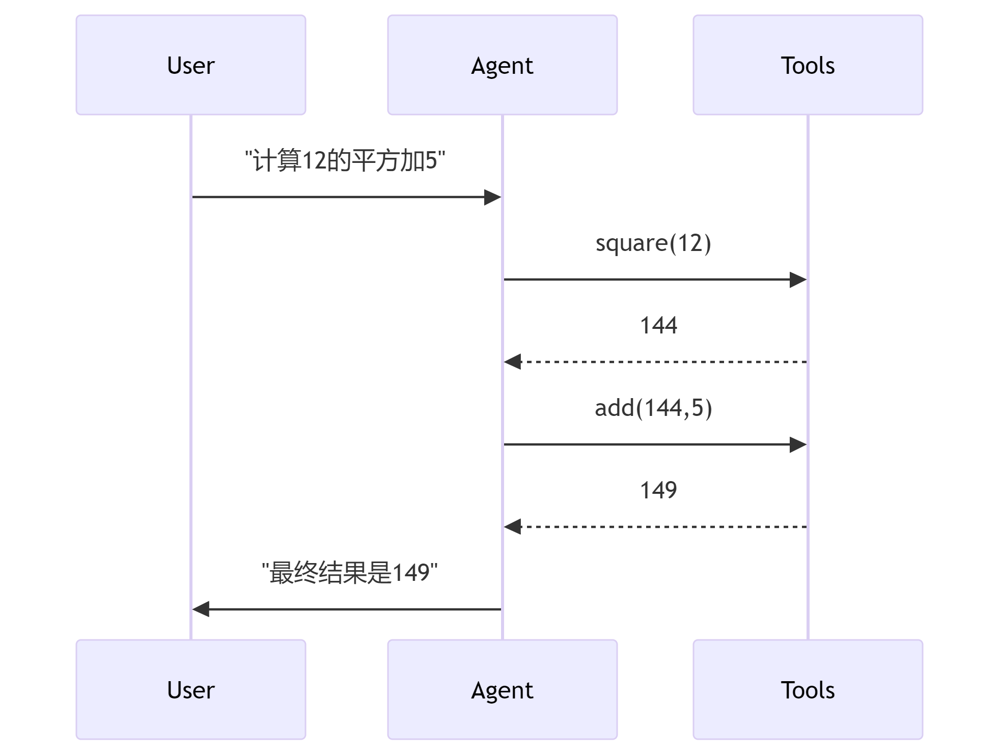

LlamaIndex 是一个专为大型语言模型（LLMs）应用设计的数据框架，旨在通过高效的数据集成和上下文增强技术，帮助开发者将私有或领域特定数据与预训练模型（如 GPT-4）结合，构建智能应用。


本文将通过几个案例，循序渐进地介绍其入门级用法，从单一的问答引擎，RAG 问答引擎，到聊天引擎，乃至构建一个 AI agent。


## Complete

使用 openAI-like 大模型构建一个问答机器人

```python
from llama_index.llms.openrouter import OpenRouter
import os

llm = OpenRouter(
    model="deepseek/deepseek-chat",
    api_key=os.getenv("OPEN_ROUTER_API_KEY"),
)

print(llm.complete("讲一个笑话吧"))
```


> LlamaIndex 提供了一个统一的接口来定义大型语言模型（LLM）模块，无论是来自 OpenAI、Hugging Face 还是 LangChain 的模型，这样您就无需自行编写定义 LLM 接口的样板代码。

## RAG
基于LlamaIndex构建的问答系统，支持本地文档检索和AI回答

```python
"""
注意：使用前需先配置OPEN_ROUTER_API_KEY和DASH_SCOPE_API_KEY环境变量
"""

import os
from llama_index.llms.openrouter import OpenRouter
from llama_index.core import Settings

# 配置大语言模型（通过OpenRouter平台）
Settings.llm = OpenRouter(
    model="deepseek/deepseek-chat",  # 使用的AI模型
    api_key=os.getenv("OPEN_ROUTER_API_KEY"),  # 从环境变量获取API密钥
)

# 从本地目录加载文档数据
from llama_index.core import SimpleDirectoryReader
from llama_index.core import VectorStoreIndex

# 读取指定目录下的文档（预处理和分割文本）
documents = SimpleDirectoryReader("./data").load_data()

# 配置文本嵌入模型（用于文档向量化）
from llama_index.embeddings.dashscope import (
    DashScopeEmbedding,
    DashScopeTextEmbeddingModels,
    DashScopeTextEmbeddingType,
)

# 初始化文档嵌入模型（用于构建向量索引）
Settings.embed_model = DashScopeEmbedding(
    model_name=DashScopeTextEmbeddingModels.TEXT_EMBEDDING_V2,  # 使用V2嵌入模型
    text_type=DashScopeTextEmbeddingType.TEXT_TYPE_DOCUMENT,    # 指定处理文档类型
    api_key=os.getenv("DASH_SCOPE_API_KEY"),                    # 阿里云API密钥
)

# 构建向量存储索引（包含文档嵌入和向量存储）
index = VectorStoreIndex.from_documents(
    documents, 
    show_progress=True  # 显示索引构建进度条
)

# 创建查询引擎（将自然语言转换为检索查询）
query_engine = index.as_query_engine()

# 交互式问答循环
while True:
    question = input("you: ")
    if question == "quit":  # 退出命令
        break
    # 执行查询（包含检索文档和生成回答）
    response = query_engine.query(question)
    print(response)
```

代码执行流程说明：
1. 初始化大语言模型和服务配置
2. 加载本地文档并进行预处理
3. 使用嵌入模型将文本转换为向量表示
4. 构建向量索引以提高检索效率
5. 通过交互式界面接受用户问题
6. 结合向量检索和大语言模型生成答案


## Agent
基于ReAct框架构建的智能代理系统，支持工具调用与大模型推理
```python
"""
注意：需配置OPEN_ROUTER_API_KEY环境变量，建议使用Python 3.10+环境
"""

from llama_index.llms.openrouter import OpenRouter
from llama_index.core.agent import ReActAgent
from llama_index.core.tools import FunctionTool
import os

# 定义数学工具函数 ---------------------------------------------------
def multiply(a: float, b: float) -> float:
    """数值乘法工具，处理两个浮点数的相乘运算"""
    return a * b

# 将函数转换为工具（自动生成工具描述）
multiply_tool = FunctionTool.from_defaults(
    fn=multiply,  # 绑定目标函数
    name="number_multiplier"  # 默认生成工具名称
)

def add(a: float, b: float) -> float:
    """数值加法工具，处理两个浮点数的求和计算"""
    return a + b

add_tool = FunctionTool.from_defaults(
    fn=add,
    name="number_adder"  # 在工具调用时使用的标识符
)

# 配置大语言模型 ----------------------------------------------------
llm = OpenRouter(
    model="openai/gpt-4o-2024-11-20",  # 通过OpenRouter接入GPT-4
    api_key=os.getenv("OPEN_ROUTER_API_KEY"),  # 从环境变量获取认证密钥
    temperature=0.3  # 默认控制生成随机性（隐式参数示例）
)

# 创建智能代理 ------------------------------------------------------
agent = ReActAgent.from_tools(
    tools=[multiply_tool, add_tool],  # 可用的工具集
    llm=llm,  # 绑定语言模型
    verbose=True  # 显示详细的推理过程
)

# 交互式会话循环 ----------------------------------------------------
while True:
    question = input("you: ")  # 接收自然语言输入
    if question.lower() in ["quit", "exit"]:  # 增强退出指令检测
        break
    # 执行推理流程（包含Thought/Action/Observation循环）
    response = agent.chat(question)
    print(f"Agent: {response}")

```

Agent 调用工具示例图：


代码架构说明：
1. 工具层：封装可操作函数，扩展代理能力边界
2. 模型层：通过OpenRouter接入顶尖大模型
3. 代理层：ReAct架构协调工具调用与推理步骤
4. 交互层：自然语言用户界面

关键处理流程：
1. 用户输入解析 → 2. ReAct规划 → 3. 工具选择 → 4. 执行反馈 → 5. 结果生成

## RAG + Agent
融合检索增强(RAG)与工具调用的智能代理系统
结合本地知识库与数学计算能力，支持复杂任务处理

```python
"""
环境要求：需配置OPEN_ROUTER_API_KEY和DASH_SCOPE_API_KEY环境变量
"""

from llama_index.llms.openrouter import OpenRouter
from llama_index.core.agent import ReActAgent
from llama_index.core import Settings
from llama_index.core.tools import FunctionTool
import os
import chromadb  # 本地向量数据库
from llama_index.vector_stores.chroma import ChromaVectorStore
from llama_index.core import StorageContext

# 全局大模型配置 ----------------------------------------------------
Settings.llm = OpenRouter(
    model="openai/gpt-4o-2024-11-20",    # 使用GPT-4最新版本
    api_key=os.getenv("OPEN_ROUTER_API_KEY"),  # 路由平台密钥
    max_tokens=120000  # 设置最大上下文长度（需确认模型实际支持长度）
)

# 嵌入模型配置 ------------------------------------------------------
from llama_index.embeddings.dashscope import (
    DashScopeEmbedding,
    DashScopeTextEmbeddingModels,
    DashScopeTextEmbeddingType,
)

Settings.embed_model = DashScopeEmbedding(
    model_name=DashScopeTextEmbeddingModels.TEXT_EMBEDDING_V2,  # 阿里云V2嵌入模型
    text_type=DashScopeTextEmbeddingType.TEXT_TYPE_DOCUMENT,    # 文档处理模式
    api_key=os.getenv("DASH_SCOPE_API_KEY")                     # 阿里云API密钥
)

# 数学工具定义 ------------------------------------------------------
def multiply(a: float, b: float) -> float:
    """精确数值乘法工具，支持大数计算"""
    return a * b

multiply_tool = FunctionTool.from_defaults(
    fn=multiply,
    name="advanced_calculator"  # 增强工具标识
)

def add(a: float, b: float) -> float:
    """高精度加法工具，支持科学计数法输入"""
    return a + b

add_tool = FunctionTool.from_defaults(
    fn=add,
    name="scientific_adder"  # 明确工具应用场景
)

# 知识库初始化 -----------------------------------------------------
from llama_index.core import SimpleDirectoryReader, VectorStoreIndex

# 加载本地文档数据（支持多种格式）
documents = SimpleDirectoryReader("./data").load_data()

# 初始化ChromaDB客户端（持久化存储）
db = chromadb.PersistentClient(path="./chroma_db2")  # 向量存储路径

# 创建/获取向量集合（按业务场景隔离）
chroma_collection = db.get_or_create_collection(
    "quickstart",  # 集合名称
    metadata={"hnsw:space": "cosine"}  # 优化相似度计算
)

# 构建存储上下文
vector_store = ChromaVectorStore(chroma_collection=chroma_collection)
storage_context = StorageContext.from_defaults(vector_store=vector_store)

# 创建带持久化的向量索引
index = VectorStoreIndex.from_documents(
    documents, 
    storage_context=storage_context,  # 绑定Chroma存储
    show_progress=True  # 显示索引构建进度
)

# 初始化查询引擎（带相似度检索功能）
query_engine = index.as_query_engine(
    similarity_top_k=5  # 检索前5个相关片段
)

# 包装RAG功能为工具 ------------------------------------------------
from llama_index.core.tools import QueryEngineTool

rag_tool = QueryEngineTool.from_defaults(
    query_engine=query_engine,
    name="enterprise_knowledge_base",  # 明确工具用途
    description="访问包含公司技术文档、产品规格和客户案例的知识库",  # 指导模型调用
    tool_metadata={"version": "1.2.0"}  # 添加元数据
)

# 构建全能代理 -----------------------------------------------------
agent = ReActAgent.from_tools(
    tools=[multiply_tool, add_tool, rag_tool],  # 组合计算与知识能力
    llm=Settings.llm,
    verbose=True,  # 显示推理过程
    max_iterations=10  # 防止无限循环
)

# 交互主循环 -------------------------------------------------------
while True:
    try:
        question = input("you: ")
        if question.lower() in ["quit", "exit"]:
            break
        # 执行多模态推理（自动选择工具/知识库）
        response = agent.chat(f"当前时间：{time.ctime()}\n用户提问：{question}")
        print(f"Agent: {str(response)[:500]}...")  # 防止输出过长
    except KeyboardInterrupt:
        print("\n系统安全退出")
        break
```

系统架构解析：
1. 知识层：ChromaDB向量存储 + 本地文档
2. 工具层：数学计算 + 知识检索双能力
3. 推理层：ReAct框架协调多工具协作
4. 交互层：自然语言对话接口

核心优势：
- 持久化存储：重启后无需重建索引
- 多源输入：支持增量文档加载
- 混合处理：同时处理数值计算与语义查询
- 可追溯性：verbose模式显示决策过程


## 综合应用：智能辩论 AI agent

基于双Agent的自动化辩论系统
实现立场对立的人工智能辩论双方持续辩论

```python
from llama_index.core.agent import ReActAgent
from llama_index.llms.openrouter import OpenRouter
from llama_index.core.tools import FunctionTool
import os


class Debater:
    def __init__(self, llm=None, tools=None, topic="今天晚上吃什么"):
        self.topic = topic
        # 初始化LLM（使用OpenRouter或默认配置）
        self.llm = llm or OpenRouter(
            model="deepseek/deepseek-chat",
            api_key=os.getenv("OPEN_ROUTER_API_KEY"),
        )

        # 初始化工具（继承原始agent的功能）
        self.tools = tools or [
            FunctionTool.from_defaults(
                fn=lambda a, b: a * b,
                name="multiply",
                description="Multiply two numbers",
            ),
            FunctionTool.from_defaults(
                fn=lambda a, b: a + b, name="add", description="Add two numbers"
            ),
        ]

        # 创建己方和对方两个agent
        self.self_agent = ReActAgent.from_tools(
            self.tools,
            llm=self.llm,
            verbose=False,
            max_iterations=1300,
        )
        from llama_index.core.prompts import PromptTemplate

        # Define your custom system prompt
        self.self_agent.update_prompts(
            {
                "agent_worker:system_prompt": PromptTemplate(
                    f"你作为正方辩论选手，而我作为反方辩论选手，将围绕 '{self.topic}' 展开辩论。每次发言请控制在300字以内"
                )
            }
        )

        self.opponent_agent = ReActAgent.from_tools(
            self.tools,
            llm=self.llm,
            verbose=False,
            max_iterations=1300,
        )
        self.opponent_agent.update_prompts(
            {
                "agent_worker:system_prompt": PromptTemplate(
                    f"你作为反方辩论选手，而我作为正方辩论选手，将围绕 '{self.topic}' 展开辩论。每次发言请控制在300字以内"
                )
            }
        )

    def start_debate(self, max_rounds=50):
        """启动辩论流程"""
        print(f"\n辩论主题: {self.topic}")
        history = []

        # 己方先发言（获取字符串响应）
        response = self.self_agent.chat("开始辩论").response  # 提取实际响应内容
        print(f"己方: {response}\n")
        history.append(f"己方: {response}")

        # 交替辩论
        for _ in range(max_rounds - 1):
            # 对方回应
            opponent_response = self.opponent_agent.chat(
                response
            ).response  # 同样提取响应内容
            print(f"对方: {opponent_response}\n")
            history.append(f"对方: {opponent_response}")

            input("点击请继续")
            print("\n")

            # 己方反驳
            response = self.self_agent.chat(
                opponent_response
            ).response  # 确保传递字符串
            print(f"己方: {response}\n")
            history.append(f"己方: {response}")

        return history


# 使用示例
if __name__ == "__main__":
    while True:
        topic = input("\n请输入辩论主题（输入quit退出）: ")
        if topic.lower() == "quit":
            break
        debater = Debater(topic=topic).start_debate()

```

系统设计说明：
1. 双Agent架构：独立的正反方逻辑处理
2. 记忆管理：记录完整的对话历史轨迹
3. 流程控制：支持中途终止和共识检测
4. 扩展接口：易于集成更多分析工具


## 结语
通过本文的多个案例实践，我们可以看到 LlamaIndex 为大型语言模型的智能应用开发提供了灵活且强大的基础设施。从基础的问答引擎到整合工具调用的智能代理，该框架通过模块化设计屏蔽了底层复杂性，开发者无需关注文档分割、向量索引、推理引擎等组件的技术细节，即可快速构建具备专业领域知识的 AI 系统。

目前 LlamaIndex 正处于快速发展阶段，其工具链生态持续扩充对多模态数据处理、流式推理、细粒度权限控制的支持。更多实现细节可参考[官方文档](https://docs.llamaindex.ai/)与开发者社区，该项目的迭代速度与活跃社区将为企业智能化转型提供持久助力。