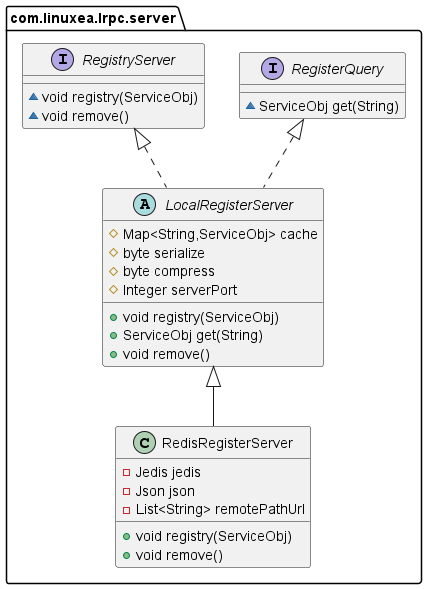
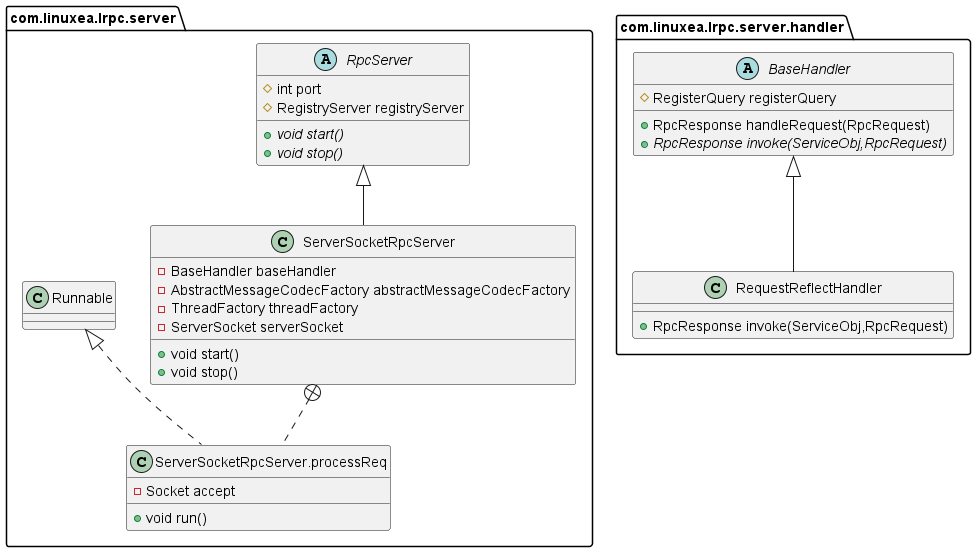
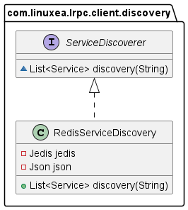
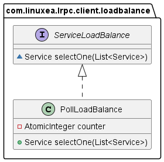
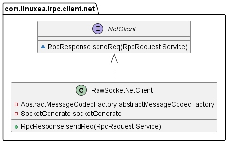
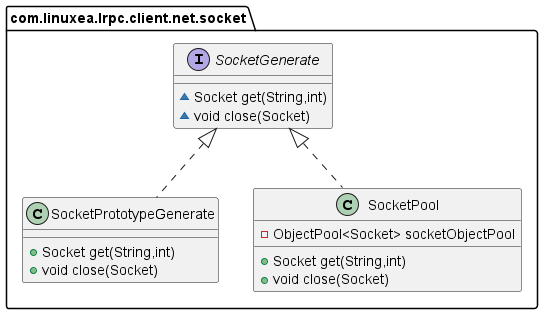
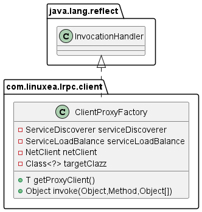

## 实现一个玩具类 rpc

> Remote Procedure Call is a software communication protocol that one program can use to request a service from a program located in another computer on a network without having to understand the network's details. RPC is used to call other processes on the remote systems like a local system. A procedure call is also sometimes known as a function call or a subroutine call.


## RPC process

不过多介绍 RPC 的概念。主要从实现角色来看看实现一个简易版本的 RPC 的步骤。


During an RPC, the following steps take place:

The client calls the client stub. The call is a local procedure call with parameters pushed onto the stack in the normal way.
The client stub packs the procedure parameters into a message and makes a system call to send the message. The packing of the procedure parameters is called marshalling.
The client's local OS sends the message from the client machine to the remote server machine.
The server OS passes the incoming packets to the server stub.
The server stub unpacks the parameters -- called unmarshalling -- from the message.
When the server procedure is finished, it returns to the server stub, which marshals the return values into a message. The server stub then hands the message to the transport layer.
The transport layer sends the resulting message back to the client transport layer, which hands the message back to the client stub.
The client stub unmarshalls the return parameters, and execution returns to the caller.


一次完整的 RPC 过程中，会有如下的步骤：
- client 调用 client stub(客户端的本地存根，代表着远程方法)。这是一次本地调用，会将调用参数以普通方法调用的形式入栈
- client stub 打包参数到消息中，这个过程称为 marshal
- 客户端获取对应的远程服务器地址，发起一次系统调用，本地操作系统将消息从客户端机器发送到远程服务的机器
- server 操作系统将进来的消息包传递给 server stub
- server stub 从消息中解包出请求参数（相应地称为 unmarshal），将根据请求找到对应的 server producer 并执行
- server 端方法执行完成后，server stub 将返回值 marshal 到一个消息中，并将消息传递给传输层
- 传输层将生成的消息发送回客户端传输层，客户端传输层将消息返回给 client stub
- client stub unmarshal 响应消息并获取返回的参数，return 给 client 端调用者


从这个过程中，我们可以看到 client stub 与 server stub 的不同处理，以及 marshal 与 unmarshal 的通用处理。因此可以将整个 RPC 拆分成不同的模块来开发与维护。

- server
   - 服务注册
   - 服务提供者
   - server stub
- client
   - 服务发现与负载均衡
   - 服务调用者
   - client stub
- common
   - 序列化与反序列化
   - 解压缩
   - 消息编码

## Server


### 服务注册与发现



ServiceObj 用来代表 server 端的一个服务提供者对象。
```java
ServiceObj serviceObj = new ServiceObj();
serviceObj.setName(Hello.class.getName()); // 服务名称
serviceObj.setClazz(Hello.class); // class 缓存避免反射频繁获取
serviceObj.setObj(new HelloImpl()); // 具体的服务提供者实现
```

RegisterServer 定义了服务注册与移除接口
- LocalRegisterServer 为本地实现，维护服务名称与服务提供者的关系
- RedisRegisterServer 为远程实现，redis 存储着服务注册信息
- LocalRegisterServer 与 RedisRegisterServer 通关服务名称进行关联查找

RegisterQuery 定义了本地服务查找
- get(string) 通过服务名称查询 LocalRegisterServer 维护的服务提供者


### rpc 服务器



- RPCServer 定义了 rpc server 的启动与停止，ServerSocketRpcServer 是 RPCServer 的实现
- ServerSocketRpcServer 的 AbstractMessageCodecFactory 对 client 请求消息进行编解码
- BaseHandler 是请求消息处理的抽象接口，RPCServer 将请求消息的处理实现委托给 BaseHandler
- RequestReflectHandler 是 BaseHandler 的用反射来调用的实现


## Client


### 服务发现


- Service 代表了注册中心关于一个服务的信息，如服务名，ip, port 
- ServiceDiscoverer 定义了给定服务名的服务发现接口
- RedisServiceDiscovery 是 ServiceDiscoverer 关于 redis 做为远程服务信息保存的实现


### 客户端负载均衡

- ServiceLoadBalance 定义了负载均衡的接口，通过给定一组服务获取一个服务
- PollLoadBalance 为轮询负载的实现


### 客户端网络请求



- NetClient 定义了客户端网络请求接口的定义，参数为客户端本地 RpcRequest 包装信息以及请求的服务 service，以及服务端响应 RpcResponse
- RawSocketNetClient 是 NetClient 的关于原生 socket 实现。



- SocketGenerate 定义了 socket 的获取与关闭
- SocketPool 为 socket 复用连接池的实现。
- SocketPrototypeGenerate 为每次请求都创建一个新 socket 的实现


### 客户端动态代理


通过 jdk 动态代理，我们会客户端方法句柄生成代理对象，具体的 InvocationHandler 实现如下:
```java
public Object invoke(Object proxy, Method method, Object[] args) throws Throwable {

    //1. 获得服务信息
    String serviceName = targetClazz.getName();
    List<Service> services = serviceDiscoverer.discovery(serviceName);
    Service selectOne = serviceLoadBalance.selectOne(services);

    //2. 构建request对象
    RpcRequest rpcRequest = new RpcRequest();
    rpcRequest.setRequestId(UUID.randomUUID().toString());
    rpcRequest.setServiceName(serviceName);
    rpcRequest.setMethod(method.getName());
    rpcRequest.setParametersTypes(method.getParameterTypes());
    rpcRequest.setParameters(args);

    //3. 发送请求
    RpcResponse rpcResponse = netClient.sendReq(rpcRequest, selectOne);

    // 4. 请求结果校验
    if (rpcResponse.getException() != null) {
      throw rpcResponse.getException();
    }

    return rpcResponse.getReturnValue();
  }
```


获取上面代理过的一个真实对象：
```java
public <T> T getProxyClient() {
    return (T) Proxy.newProxyInstance(targetClazz.getClassLoader(),
        new Class[]{targetClazz}, this);
  }
```