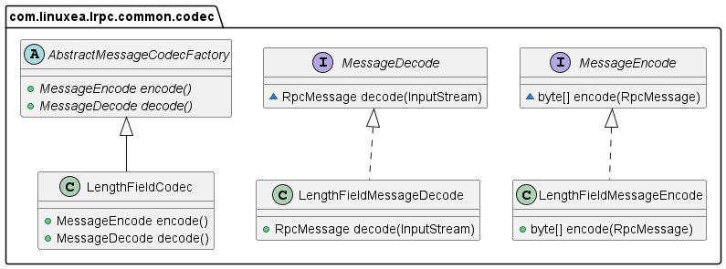
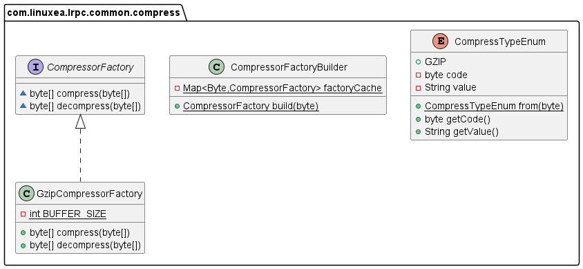
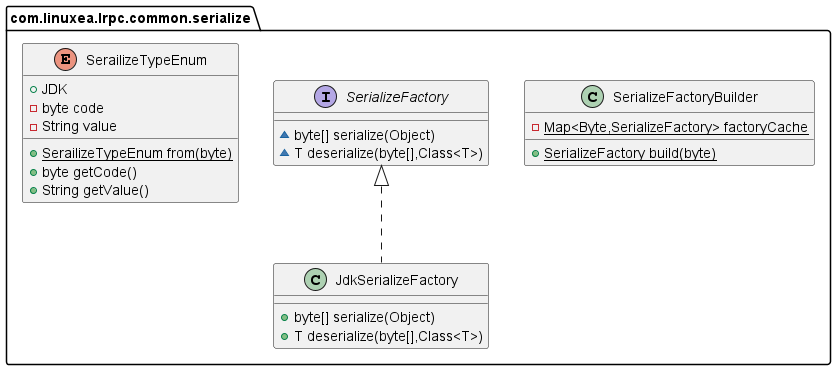

# 实现一个玩具类 rpc

> Remote Procedure Call is a software communication protocol that one program can use to request a service from a program located in another computer on a network without having to understand the network's details. RPC is used to call other processes on the remote systems like a local system. A procedure call is also sometimes known as a function call or a subroutine call.


## RPC process

今天不过多介绍 RPC 的概念。

主要从实现角色来看看实现一个简易版本的 RPC 的步骤。

一次完整的 RPC 过程中，会有如下的步骤：
- `client` 调用 `client stub` (客户端的本地存根，代表着远程方法)。这是一次本地调用，会将调用参数以普通方法调用的形式入栈
- `client stub` 打包参数到消息中，这个过程称为 `marshal`
- 客户端获取对应的远程服务器地址，发起一次系统调用，本地操作系统将消息从客户端机器发送到远程服务的机器
- `server` 操作系统将进来的消息包传递给 `server stub`
- `server stub` 从消息中解包出请求参数（相应地称为 `unmarshal` ），将根据请求找到对应的 `server provider` 并执行
- `server` 端方法执行完成后，`server stub` 将返回值 `marshal` 到一个消息中，并将消息传递给传输层
- 传输层将生成的消息发送回客户端传输层，客户端传输层将消息返回给 `client stub`
- `client stub` `unmarshal` 响应消息并获取返回的参数，`return` 给 `client` 端调用者


从这个过程中，我们可以看到 client stub 与 server stub 的不同处理，以及 marshal 与 unmarshal 的通用处理。因此可以将整个 RPC 拆分成不同的模块来开发与维护。

- server
   - 服务注册
   - 服务提供者
   - server stub
- client
   - 服务发现与负载均衡
   - 服务调用者
   - client stub
- common
   - 序列化与反序列化
   - 解压缩
   - 消息编码

## Server


### 服务注册与发现


ServiceObj 用来代表 server 端的一个服务提供者对象。
```java
ServiceObj serviceObj = new ServiceObj();
serviceObj.setName(Hello.class.getName()); // 服务名称
serviceObj.setClazz(Hello.class); // class 缓存避免反射频繁获取
serviceObj.setObj(new HelloImpl()); // 具体的服务提供者实现
```

RegisterServer 定义了服务注册与移除接口
- LocalRegisterServer 为本地实现，维护服务名称与服务提供者的关系
- RedisRegisterServer 为远程实现，redis 存储着服务注册信息
- LocalRegisterServer 与 RedisRegisterServer 通关服务名称进行关联查找

RegisterQuery 定义了本地服务查找
- get(string) 通过服务名称查询 LocalRegisterServer 维护的服务提供者


### rpc 服务器


- `RPCServer` 定义了 rpc 服务器的启动与停止，`ServerSocketRpcServer` 是 RPCServer 的实现
- `ServerSocketRpcServer` 的 `AbstractMessageCodecFactory` 对 client 请求消息进行编解码
- `BaseHandler` 是请求消息处理的抽象接口，`RPCServer` 将请求消息的处理实现委托给 `BaseHandler`
- `RequestReflectHandler` 是 `BaseHandler` 的用反射来调用的实现


## Client


### 服务发现


- `Service` 代表了注册中心关于一个服务的信息，如服务名，ip, port 
- `ServiceDiscoverer` 定义了给定服务名的服务发现接口
- `RedisServiceDiscovery` 是 ServiceDiscoverer 关于 redis 做为远程服务信息保存的实现


### 客户端负载均衡


- `ServiceLoadBalance` 定义了负载均衡的接口，通过给定一组服务获取一个服务
- `PollLoadBalance` 为轮询负载的实现


### 客户端网络请求


- `NetClient` 定义了客户端网络请求接口的定义，参数为客户端本地 RpcRequest 包装信息以及请求的服务 service，以及服务端响应 RpcResponse
- `RawSocketNetClient` 是 NetClient 的关于原生 socket 实现。


- `SocketGenerate` 定义了 socket 的获取与关闭
- `SocketPool` 为 socket 复用连接池的实现。
- `SocketPrototypeGenerate` 为每次请求都创建一个新 socket 的实现


### 客户端动态代理


通过 `jdk` 动态代理，我们会客户端方法句柄生成代理对象，具体的 `InvocationHandler` 实现如下:
```java
public Object invoke(Object proxy, Method method, Object[] args) throws Throwable {

    //1. 获得服务信息
    String serviceName = targetClazz.getName();
    List<Service> services = serviceDiscoverer.discovery(serviceName);
    Service selectOne = serviceLoadBalance.selectOne(services);

    //2. 构建request对象
    RpcRequest rpcRequest = new RpcRequest();
    rpcRequest.setRequestId(UUID.randomUUID().toString());
    rpcRequest.setServiceName(serviceName);
    rpcRequest.setMethod(method.getName());
    rpcRequest.setParametersTypes(method.getParameterTypes());
    rpcRequest.setParameters(args);

    //3. 发送请求
    RpcResponse rpcResponse = netClient.sendReq(rpcRequest, selectOne);

    // 4. 请求结果校验
    if (rpcResponse.getException() != null) {
      throw rpcResponse.getException();
    }

    return rpcResponse.getReturnValue();
  }
```


获取上面代理过的一个真实对象：
```java
public <T> T getProxyClient() {
    return (T) Proxy.newProxyInstance(targetClazz.getClassLoader(),
        new Class[]{targetClazz}, this);
  }
```


## Common

`common` 模块是 client server 共用的模块
主要包括`消息的编解码`，`序列化与反序列化`，`加密与解密`，以及共用消息体 `RpcRequest`, `RpcResponse` 等等


### Codec



- `MessageEncode` 定义了编码接口，将传输消息 `RPCMessage` 做编码处理，返回字节数组 `byte[]`
- `MessageDecode` 定义了解码接口，将 `InputStream` 做解码处理，返回 `RpcMessage` 
- `LengthFieldMessageEncode` 为 MessageEncode 的基于长度的编码实现。
   - `MAGIC_NUM` 4个字节表示
   - `MESSAGE_TYPE` 1个字节表示
   - `FULL_LENGTH` 编码消息总字节数，4个字节表示
   - `PROTOCOL_VERSION` 1个字节表示
   - `SERIALIZE_TYPE` 序列化类型，1个字节表示
   - `COMPRESS_TYPE` 压缩类型，1个字节表示
   - `message body` 消息体 ，字节长度计算（FULL_LENGTH - (4 + 1 + 4 + 1 + 1 + 1) = （FULL_LENGTH - 12）
- `LengthFieldMessageDecode` 为 MessageDecode 的基于长度的解码实现。根据 LengthFieldMessageEncode 编码规则进行解码
- `AbstractMessageCodecFactory` 为编码工厂方法

查看编码与解码的相关代码：

LengthFieldMessageEncode:
```java
byte serialize = obj.getSerialize();
byte[] serializeBytes = SerializeFactoryBuilder.build(serialize).serialize(obj);

byte compress = obj.getCompress();
byte[] compressBytes = CompressorFactoryBuilder.build(compress).compress(serializeBytes);

// body and it's length
int bodyLength = compressBytes.length;
int fullLength = 12 + bodyLength; // four bytes for full length field
ByteBuffer byteBuffer = ByteBuffer.allocate(fullLength);
byteBuffer.put(CodecConstant.MAGIC_NUM).put((byte) 1).putInt(fullLength).put((byte) 1).put(SerailizeTypeEnum.from(serialize).getCode()).put(CompressTypeEnum.GZIP.getCode()).put(compressBytes);
return byteBuffer.array();
```

LengthFieldMessageDecode:
```java
byte[] magicNum = inputStream.readNBytes(4);
byte[] version = inputStream.readNBytes(1);
byte[] fullLength = inputStream.readNBytes(4);
byte[] messageType = inputStream.readNBytes(1);
byte[] serializeType = inputStream.readNBytes(1);
byte[] compressType = inputStream.readNBytes(1);
// extract data bytes
ByteBuffer buffer = ByteBuffer.allocate(Integer.BYTES);
buffer.put(fullLength);
buffer.rewind();
int value = buffer.getInt();
byte[] dataBytes = inputStream.readNBytes(value - 12);
// uncompress
byte[] decompress = CompressorFactoryBuilder.build(compressType[0]).decompress(dataBytes);
// deserialize
return SerializeFactoryBuilder.build(serializeType[0]).deserialize(decompress, RpcMessage.class);
```


### Compress


- `CompressorFactory` 定义了消息体的解压缩接口
- `CompressTypeEnum` 定义了消息压缩的算法枚举
- `CompressorFactoryBuilder` 为消息压缩的 `builder` 构建者
- `GzipCompressorFactory` 为消息体解压缩接口的 `Gzip` 算法实现

### Serialize


同 Compress 压缩模块相似。

`Serialize` 模块是关于消息体序列化与反序列化接口的定义与实现。


## Summary

通过按模块拆分来实现一个简易版本的 rpc


了解其不同的组成以及如何相互协作来达到进程间远程通信的目的。


## Reference

- [1] [Java开发者的RPC实战课](https://juejin.cn/book/7047357110337667076?scrollMenuIndex=0)
- [2] [rpc-spring-starter](https://github.com/PPPHUANG/rpc-spring-starter)
- [3] [Dynamic Proxies in Java](https://www.baeldung.com/java-dynamic-proxies)
- [4] [big-endian and little-endian](https://www.techtarget.com/searchnetworking/definition/big-endian-and-little-endian)


