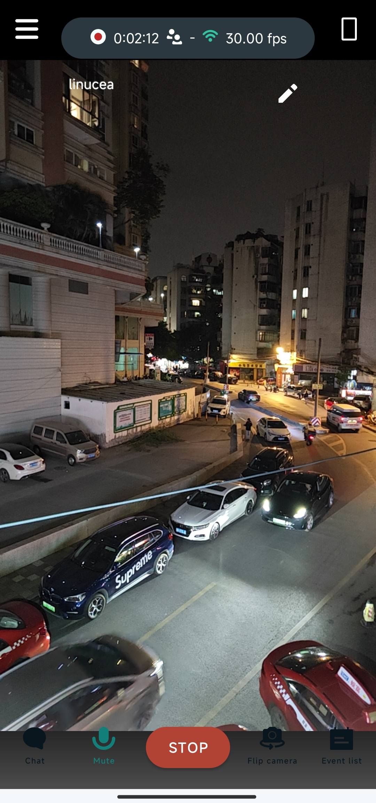
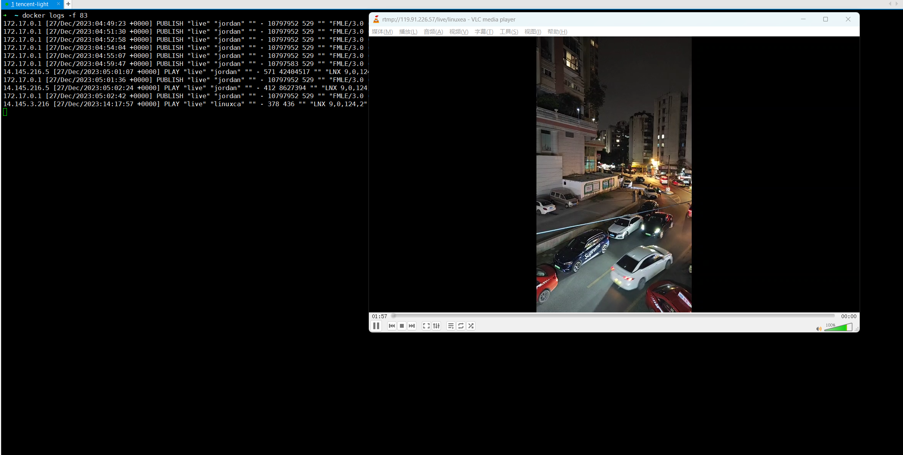

# RTMP 在直播场景的应用


## RTMP (Real Time Messaging Protocol)

### 简介

RTMP（Real Time Messaging Protocol）是一种设计用于实时数据通信的网络协议，主要用于在 Flash/AIR 平台和支持 RTMP 服务器之间流式传输音频、视频和数据。

RTMP 是一种 TCP/IP 协议，通常运行在1935端口上。它维护持久的连接，并允许低延迟通信，使得视频和音频流可以平滑地在用户和服务器之间传输。这种协议非常适合需要低延迟的直播应用，例如直播视频播放或在线游戏。

### RTMP 协议的设计特点

RTMP 协议之所以适合实时数据通信，是因为它具备以下设计特征和优势：

- 持久连接：RTMP 在客户端和服务器之间建立了一个持久的 TCP 连接，这种连接方式可以保持数据流的持续和稳定传输，适合视频和音频这样的连续媒体数据。

- 低延迟：RTMP 协议针对实时性做了优化，能够快速地传递数据，减少缓冲，这对于直播流媒体来说至关重要。

- 数据分块：RTMP 将数据分成小块传输，这使得即使在网络条件不佳的情况下，也能够实现流畅的播放，因为小块数据更容易快速处理和传输。

- 流控制：RTMP 允许对数据流进行各种控制，如暂停、播放、停止等操作，这些控制命令可以实时发送，使用户和服务器能够实时交互。

- 带宽检测和管理：RTMP 协议可以动态检测当前的网络带宽，并调整数据传输速率，以适应不同的网络环境，确保视频流尽可能平滑。

- 消息类型多样：RTMP 支持多种类型的消息，包括音频、视频、命令和数据消息。这种多样性允许 RTMP 传输各种类型的内容，而不仅仅是媒体数据。

- 上下行对等：RTMP 支持双向通信，使得客户端和服务器都可以发送和接收数据，这对于交互式应用程序来说是必须的。

- 灵活性：RTMP 协议可以被封装进其他协议中（例如 RTMPT 是 RTMP 封装在 HTTP 中），使其能够穿透防火墙，增加了它的实用性。


## RTMP 服务器

> 支持 RTMP 协议的软件服务器众多，包含 SRS，Adobe Media Server，Wowza Streaming Engine，Red5，nginx ... ...

其中之一的 Nginx 作为一款高性能的 http 与反向代理服务，通过 RTMP 模块为 Nginx 添加了实时消息传输协议 (RTMP) 的支持，使其能够作为一个完整的流媒体服务器来处理视频和音频流。

Nginx RTMP Module 的主要特点如下：

- 直播流支持：可以接收来自各种源（如 OBS、XSplit、FFmpeg）的 RTMP 流，并将其作为直播流分发。
- 流式录制：可以将传入的直播流录制到磁盘中。
- HLS 支持：支持 HTTP Live Streaming（HLS），能够把 RTMP 流转换成 HLS，以在不支持 RTMP 的设备（如 iOS 设备）上播放。
- 多路复用：可以将单个流同时推送到多个终端，例如同时推流到不同的直播平台。
- 流重定向和控制：可以控制流的发布和播放，比如限制哪些 IP 可以发布流或者播放流。
- 流转码：可以使用 FFmpeg 与 Nginx RTMP 模块结合进行流的转码操作，以适应不同带宽或设备要求。

### 安装

要使用 Nginx 的 RTMP 模块，通常需要从源代码编译 Nginx，并在编译时添加 RTMP 模块。这是因为大多数预编译的 Nginx 包并不包含该模块。编译 Nginx 时，需要使用 --add-module 配置参数指向 RTMP 模块的源代码目录。

### 配置

并添加一个 rtmp 块，其中定义了 RTMP 相关的设置。

```
rtmp {
    server {
        listen 1935; # RTMP 默认端口
        chunk_size 4096; # 设置 RTMP 分块的大小

        application live {
            live on; # 开启直播
            record off; # 关闭录制功能
            # 更多配置...
        }

        # 其他 application 配置...
    }
}
```

## 动手操作

### 启动 nginx 与 RTMP 模块

为了快捷演示，我们使用已经集成 RTMP 模块的 nginx docker 镜像 `tiangolo/nginx-rtmp` 来构建我们的镜像：

DockerFile
```bash
FROM tiangolo/nginx-rtmp

COPY nginx.conf /etc/nginx/nginx.conf
```

nginx.conf
```bash
user  root;
worker_processes  1; # 根据你的服务器硬件配置调整工作进程的数量

events {
    worker_connections  1024; # 每个进程的最大连接数
}

# RTMP 配置
rtmp {
    server {
        listen 1935; # 监听的端口
        chunk_size 4096; # RTMP数据传输的块大小

        # RTMP应用配置
        application live {
            live on; # 允许实时视频流
            record off; # 关闭录制功能
    }
}
```

构建
```bash
➜  docker build -t nginxrtmp:1.0 .                      
```

创建容器
```bash
➜  docker run -d -p 1935:1935 -p 8080:8080 nginxrtmp:1.0
```

## 发布视频流

我们这里使用安卓设备来捕获实时拍摄视频并上传到 RTMP 服务器。

常见的RTMP直播客户端
- Streamlabs: 一款非常流行的直播应用，它提供了许多直播相关的功能，包括屏幕分享、相机捕捉、实时聊天互动等。
- Broadcast Me: 这款应用允许用户使用RTMP流将直播内容推送到任何支持RTMP的服务。
- CameraFi Live: 一款可以让你通过YouTube, Facebook和其他RTMP服务器进行直播的应用，也支持外接USB摄像头。
- Larix Broadcaster: 为高级用户提供了许多定制选项的直播软件，支持RTMP和其他协议。


这里以 Streamlabs演示为主，在客户端配置好 RTMP 服务器地址与 stream key,手机端开启直播




## 拉取视频流

使用支持 RTMP 协议的 pc 客户端举例，如 VLC




到此我们就搭建了一台简单的直播服务并完成一场直播。


## 文件转视频流


除了实时直播外，我们还可以通过 FFmpeg 之类的工具来将视频文件实时编码并以 RMTP 协议传输到服务端，实现伪直播。

```bash
➜ ffmpeg -i jordan.mp4 -c:v libx264 -c:a aac -strict experimental -f flv rtmp://localhost/live/jordan    
```


这个 `ffmpeg` 命令用于将视频文件（在这个例子中是 `jordan.mp4`）转码并实时通过 RTMP 协议传输到一个本地 `nginx-rtmp` 服务器。以下是命令中各个参数的详细解释：

- `ffmpeg`: 这是调用 `ffmpeg` 程序的命令。

- `-i jordan.mp4`: `-i` 参数指定输入文件，这里的输入文件是 `jordan.mp4`。

- `-c:v libx264`: `-c:v` 参数指定视频编码器。这里使用的是 `libx264`，这是一个非常流行的开源H.264视频编码器。它负责将原始视频数据编码为 H.264 格式。

- `-c:a aac`: `-c:a` 参数指定音频编码器。这里使用的是 `aac` 编码器，它是一个广泛使用的音频编码格式，与大多数设备和流媒体服务兼容。

- `-strict experimental`: 有些 `ffmpeg` 版本要求使用此参数来启用实验性功能，尤其是在编码某些格式（如 AAC）时。不过，这个参数在新版本的 `ffmpeg` 中往往不再必要，因为 AAC 编码器已经不是实验性的了。

- `-f flv`: `-f` 参数指定输出格式。这里指定的是 `FLV`（Flash Video Format），它是与 RTMP 流媒体协议兼容的一种容器格式。

- `rtmp://localhost/live/jordan`: 指定了流的目的地。这是一个 RTMP URL，它告诉 `ffmpeg` 通过 RTMP 协议将流发送到本地服务器。在这个例子中，`localhost` 表示 RTMP 服务器运行在本地机器上。


# RMTP 现状与未来

最初被设计用在 Adobe Flash Platform 上，用于流式传输音视频数据。随着时间的发展，尽管 Flash Player 被逐渐淘汰，RTMP 仍被广泛用于直播流和其他实时应用中，部分原因是它的低延迟特性和对实时互动的良好支持。

- 低延迟: RTMP 适合需要低延迟交互的应用，比如直播。尽管新协议如 SRT 和 WebRTC 提供更低延迟，但 RTMP 在许多现有系统中已经成熟和稳定。

- 广泛支持: 许多流媒体平台和编码器仍然支持 RTMP，这意味着它可以与许多现有的技术和基础设施无缝集成。

- 成熟的生态系统: RTMP 拥有一个成熟的生态系统，包括流服务器（如 Adobe Media Server、Wowza、nginx-rtmp-module）、播放器和开发工具。

简单的服务器端处理: RTMP 服务器可以轻松地接收推流并将其转发或转码成其他格式，如 HLS，以便分发。

## 新生代协议
随着互联网技术的发展，出现了新的流媒体传输协议，它们旨在解决 RTMP 的一些限制，并提供更高效、更灵活的解决方案。以下列举一些新兴的流媒体协议以及它们带来的好处：

- HLS (HTTP Live Streaming): 由 Apple 开发的一种流媒体协议，它工作于 HTTP 上，更易于穿越防火墙，并允许内容分发网络（CDN）缓存，从而减少带宽需求和成本。但是，它的延迟性通常高于 RTMP。

- DASH (Dynamic Adaptive Streaming over HTTP): 类似于 HLS，DASH 也是一种自适应比特率流技术，它是通过 HTTP 传输的，支持跨平台，并被设计为开放标准。

- WebRTC (Web Real-Time Communication): 这是一个提供浏览器间（peer-to-peer）通信的协议和API集合，支持实时视频、音频和数据共享。WebRTC 设计用于极低延迟的通信，适合视频会议和实时互动应用。