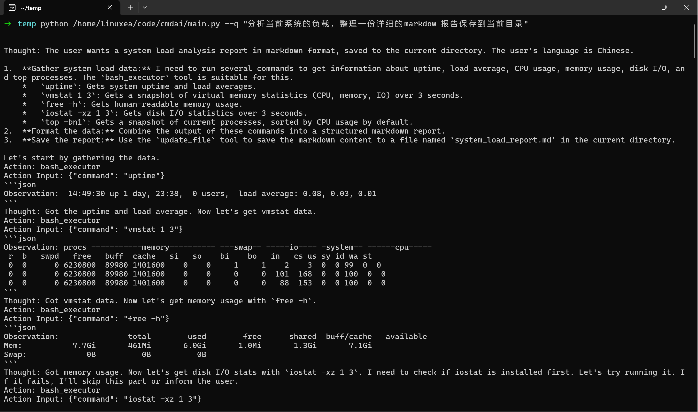

# 构建你的专属终端智能助手：命令行的新伙伴

在日常的开发和系统管理工作中，命令行终端是我们不可或缺的瑞士军刀。它强大、高效，但有时也显得有些“冷冰冰”。我们常常需要记忆繁多的命令和参数，面对复杂任务时也容易出错。

但现在，想象一下，如果你的终端不仅能忠实地执行命令，还能像一位经验丰富的伙伴一样，理解你的自然语言指令、主动提供建议、规避风险、甚至帮你自动化一些繁琐的文件操作，那将是怎样一种革命性的体验？

幸运的是，通过巧妙地结合强大的大型语言模型（LLM）和灵活的代理（Agent）框架，我们完全有能力构建这样一个自定义的、更懂你的终端智能助手，让命令行工作流焕发新的生机。

## 核心引擎：语言模型与代理框架的协同

要让终端具备真正的“智能”，首先需要一个强大的“大脑”—— 这通常是一个经过海量数据训练的大型语言模型。这类模型不仅能理解人类语言的细微差别，还能进行逻辑推理、生成代码片段，甚至理解上下文。

```python
# 此处以初始化 DeepSeek 模型为例
llm = OpenRouter(model="deepseek/deepseek-chat-v3-0324", max_tokens=16000)
```

然而，光有聪明的“大脑”还不够，它需要“手脚”来与真实世界互动。这就是代理框架发挥作用的地方。

LlamaIndex 提供的 AgentWorkflow 和 ReActAgent 扮演了关键角色。ReActAgent 并非简单地将用户输入直接丢给模型，而是采用了一种更高级的 ReAct（Reasoning and Acting，即思考与行动）模式。

在这种模式下，模型会经历一个`“思考 -> 行动 -> 观察 -> 再思考”`的循环：它首先分析用户的请求（思考），然后决定需要调用哪个工具来获取信息或执行操作（行动），接着接收工具返回的结果（观察），最后基于新的信息继续思考，直到任务完成。

这使得助手能够处理需要多步骤、涉及外部工具调用的复杂任务。

```python
# 创建 ReAct 代理，赋予其思考和调用工具的能力
reagent = ReActAgent(
    tools=[bash_executor], # 指定代理可以使用的工具
    llm=llm,                             # 连接到语言模型“大脑”
    max_iterations=100,                  # 限制思考-行动循环次数，防止无限循环
    system_prompt="""..."""             # 设定行为准则和安全指南 (详细内容省略)
)

# 创建工作流，用于管理代理的执行流程
workflow = AgentWorkflow(agents=[reagent])
```


为了让用户能够方便地与这个智能助手沟通，一个简洁的命令行界面（CLI）是必不可少的。

Python 内置的 `argparse` 库正是为此而生。通过几行代码，我们就能定义程序接受哪些参数（例如，通过 --q 参数接收用户的自然语言问题），并自动解析用户的输入，将其传递给后续的处理逻辑。这极大地降低了使用的门槛。

```python
# 创建命令行参数解析器
parser = argparse.ArgumentParser(description="DeepSeek Bash Command Agent CLI")
# 添加必需的 '-q' 参数，用于接收用户的问题
parser.add_argument("--q", help="输入你的问题", required=True)
# 解析命令行传入的参数
args = parser.parse_args()
```

## 扩展能力：从执行命令到操作文件的精细控制

这个终端助手的核心价值在于其执行实际操作的能力，而不仅仅是提供信息。通过定义一系列专门的“工具”函数，我们可以精确地赋予它所需的技能。

最基础也是最关键的一项技能，无疑是执行 Bash（或其他 `Shell）命令。bash_executor` 函数利用了 `Python` 的 `subprocess` 模块。它接收一个命令字符串（比如 "ls -l" 或 "grep 'error' /var/log/syslog"），然后在操作系统的真实 `Shell` 环境中执行它，并捕获标准输出作为结果返回。

这使得助手能够执行各种系统级的任务：查询文件列表、搜索文本内容、监控系统资源（如 top -bn1 | head -n 5 查看CPU占用最高的进程）、管理网络连接等等。

> 需要注意的是，虽然 shell=True 提供了便利，但也带来潜在的安全风险（如命令注入），因此，依赖强大的 system_prompt 来约束模型生成安全的命令至关重要。

```python
# 定义执行 Bash 命令的工具
def bash_executor(command: str) -> str:
    """用于执行 Bash 命令并返回其输出。"""
    import subprocess
    # 在 shell 中运行命令，捕获输出，并以文本形式处理
    result = subprocess.run(command, shell=True, capture_output=True, text=True)
    # 返回去除首尾空白的命令输出
    return result.stdout.strip()
```

当然，这个工具只是冰山一角。我们可以根据需要轻松扩展助手的能力库，比如添加一个用于进行网络搜索的工具（调用搜索引擎 API）、一个用于查询数据库的工具（连接数据库并执行 SQL）、或者一个用于与特定 Web 服务交互的工具（调用其 REST API）。

> 工具越丰富，助手的应用场景就越广泛。

## 安全第一：为智能助手设定明确的行为准则
赋予 AI 直接执行终端命令和修改文件的能力，无疑是一把需要谨慎使用的“双刃剑”。

如果缺乏有效的约束，它可能会意外地删除重要数据、破坏系统配置，甚至被恶意利用。因此，在设计助手时，将安全放在首位，并通过精心设计的 system_prompt（系统提示）为其设定严格的行为准则和辅助功能，是绝对必要的。

```
You are a helpful terminal AI assistant who can execute all terminal commands to provide necessary help to users. Please follow these safety and usage principles:
    Safety Limitations:
    - Avoid entering commands with interactive interfaces that can't be exited
    - Avoid executing any commands that may cause data loss
    - Avoid executing any commands that may cause system crashes
    - Avoid executing commands that might produce excessive output without limiting output length
    - Avoid executing commands that require elevated privileges (sudo/su) unless explicitly requested by the user who understands the risks
    - Refuse to execute commands that may compromise network security or violate laws and regulations
    - Avoid executing commands that may lead to excessive use of CPU, memory, or disk space

    Assistance Features:
    - Promptly inform the user and compile a list when you lack necessary tools
    - Provide detailed explanations for complex or dangerous commands to ensure the user understands their function and potential impact
    - Offer safer alternatives when necessary
    - Explain the differences in command behavior across different operating systems or environments
    - Clearly indicate the applicable environment for commands (Linux/MacOS/Windows)
    - For commands expected to produce large outputs, suggest using paging tools (less, more) or output redirection
    - Provide solutions and troubleshooting advice for common errors
    - Explain how to safely interrupt running commands (e.g., Ctrl+C)
    - Recommend creating backups or checkpoints before executing commands that may change the system state

    In every response, prioritize the security of the user's system and the integrity of their data.
```


## 工作流程与交互：流畅自然的体验

那么，当用户在命令行中输入一个问题，例如 `python your_script.py --q "查找当前目录下所有大于1MB的日志文件，并压缩它们"` 时，内部发生了什么呢？

1. 接收与启动: `argparse` 解析出用户的请求 `"查找当前目录下所有大于1MB的日志文件，并压缩它们"`，并将其传递给 `AgentWorkflow。`

2. 思考与规划 (ReAct Cycle - Step 1: Reason): `AgentWorkflow` 将任务交给 `ReActAgent`。代理内的 LLM 分析请求，理解用户的意图是分两步：a) 查找文件；b) 压缩文件。它判断这需要调用 `bash_executor` 工具。

3. 执行查找 (ReAct Cycle - Step 2: Act): 代理决定先执行查找。它可能会构思出类似 `find . -name '*.log' -size +1M` 的命令，然后调用 `bash_executor(command="find . -name '*.log' -size +1M")`。

4. 观察结果 (ReAct Cycle - Step 3: Observe): `bash_executor` 执行命令并返回找到的文件列表（例如 `"./app.log\n./debug.log"`）。

5. 再次思考与规划 (ReAct Cycle - Step 4: Reason): 代理接收到文件列表。现在它需要执行压缩任务。它可能会构思出类似 `tar -czvf large_logs.tar.gz ./app.log ./debug.log` 的命令。

6. 执行压缩 (ReAct Cycle - Step 5: Act): 代理调用 `bash_executor(command="tar -czvf large_logs.tar.gz ./app.log ./debug.log")`。

7. 观察结果 (ReAct Cycle - Step 6: Observe): `bash_executor` 返回压缩命令的输出（通常是成功信息或错误信息）。

8. 生成最终响应: 代理整合所有信息，生成一个自然语言的响应给用户，例如：`“我已经找到了大于1MB的日志文件 app.log 和 debug.log，并将它们压缩到了 large_logs.tar.gz 文件中。”`

示例演示：




## 结语：迈向更智能的命令行交互

通过将大型语言模型的理解与推理能力、代理框架的工具调用与流程控制能力、以及精心设计的安全准则相结合，我们成功地将传统的命令行终端，从一个被动的命令执行者，转变成了一个能够理解意图、主动协作、规避风险的智能伙伴。它不再仅仅是执行 ls、cd、grep，而是能够理解“帮我找到项目里所有的 TODO 注释”、“把这个 CSV 文件按第三列排序并去重”、“监控服务器的 CPU 使用率，如果超过 80% 就通知我”这样的自然语言指令，并安全、可靠地完成任务。

这不仅仅是效率的提升，更是交互方式的革新。它降低了命令行的使用门槛，让不熟悉复杂命令的用户也能借助自然语言完成任务；它提高了资深用户的生产力，将他们从重复性的工作中解放出来。这只是个性化、智能化终端演进的一个起点。

我们可以预见，未来这样的智能助手将更加强大：更深入地理解上下文、拥有更强的长期记忆、能够进行更复杂的规划、甚至主动预测用户的需求并提供建议。它们可能会深度集成到 IDE、操作系统或其他开发工具中，成为无处不在的智能编程和运维助理，让我们的数字工作环境变得前所未有的高效和便捷。构建你的专属终端智能助手，现在正是时候。