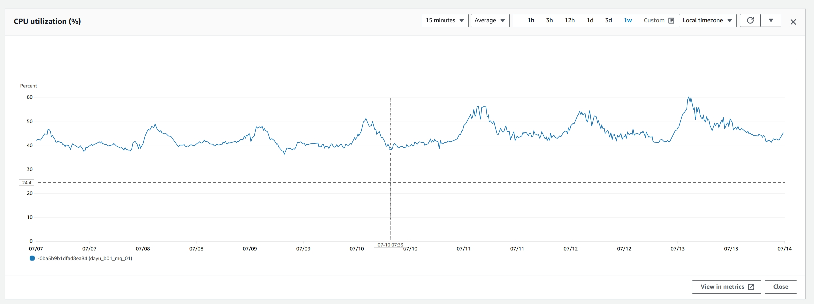
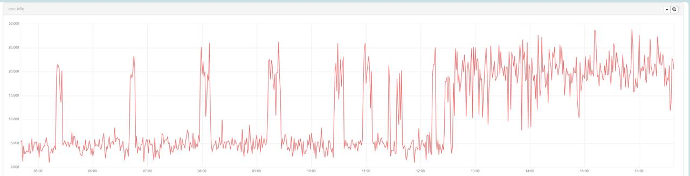
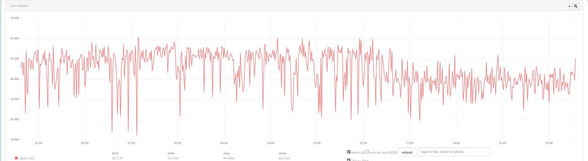
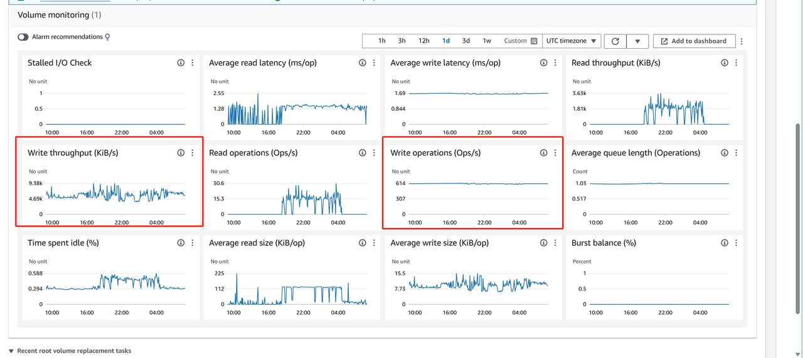
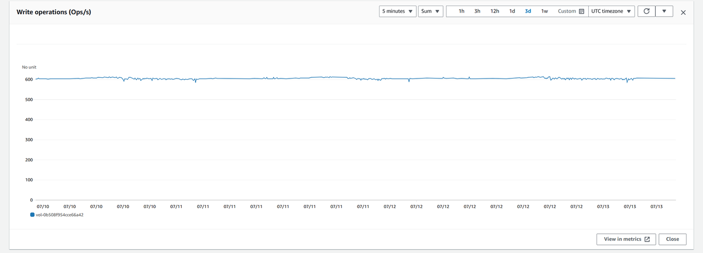

如上图，看 aws 的 b01 ，cpu 利用率实际并不高，跟 open-falcon 统计的 cpu idle idle 空闲率存在差异。

aws ec2 的 cpu 利用率统计，而 falcon “抽风”，统计的 cpu idle ，看着是把 cpu 处于 iowait 状态也计算到非空闲状态：（如下两图，体现两个指标的关系）:

查看 rabbitmq 实例挂载的硬盘：

只看 写 操作相关的统计，吞吐量在高峰期与平时存在的差异体现出来是合理的。

而 读 操作次数与吞吐量，并不能说明是存在业务逻辑代码消费上存在问题，更多的可能是 rabbitmq 本身的特性，当消息被发送到RabbitMQ时，它们首先被写入到磁盘以确保消息的持久性。这一过程导致写操作的数量和吞吐量较高。
而消息读取：消费者从RabbitMQ读取消息时，如果消息已被预先加载到内存或使用缓存机制，那么对磁盘的读取操作可能较少。这体现在平时非高峰期，足够的内存与缓存，读相关的操作统计并不明显。

所以最终结论：原因非常大可能还是 cpu 处于大量的 iowait 状态，触发 open-falcon cpu idle 低告警。而 cpu  iowait 值大的原因还是在于磁盘的吞吐性能太差，在高峰期这个问题被放大：

## 参考
- https://github.com/open-falcon/book/blob/master/en_0_2/faq/linux-metrics.md
- https://docs.aws.amazon.com/AWSEC2/latest/UserGuide/viewing_metrics_with_cloudwatch.html#ec2-cloudwatch-metrics